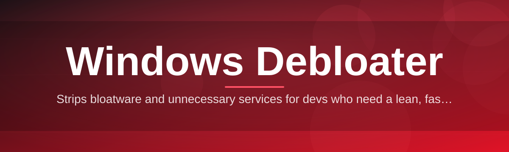

# windows-debloat-optimizer 🧹⚡

  

*Strip the bloat, keep the horsepower — a lightweight Windows Debloater built for people who just want their PC back.*

  

> [!NOTE]
> **TL;DR**
> - 🐢 → 🚀 Windows ships with dozens of background services, telemetry pipes, and pinned apps you never asked for — this tool removes/tames them safely.
> - 🖱️ One-click presets plus granular toggles, so both beginners and power users get exactly the level of control they want.
> - 🔒 No accounts, no telemetry of its own, no background daemon — it runs, it optimizes, it gets out of your way.

## 🔍 Overview

Modern Windows installs arrive pre-loaded with consumer apps, ad-serving widgets, redundant scheduled tasks, and telemetry services that quietly chew through CPU cycles, RAM, and — on laptops — battery life. `windows-debloat-optimizer` exists because reinstalling Windows from scratch every time you want a clean machine is absurd, and because most "debloat" scripts floating around the internet are unreadable one-off `.bat` files with zero transparency about what they actually touch on your registry or services.

This project is a **Windows Debloater** built with a very specific philosophy: every tweak is visible, every action is reversible where technically possible, and nothing runs silently in the background after you close the app. It's aimed at gamers chasing lower input latency, developers who want a leaner dev box, IT admins provisioning fleets of machines, and everyday users who are simply tired of Windows feeling like it's working against them.

Whether you're doing a fresh install and want to pre-empt the bloat, or you're rescuing a three-year-old laptop groaning under scheduled tasks and pinned Store apps, this tool gives you a structured, auditable way to reclaim performance without turning your system into an unsupported Frankenstein build.

  

---

## 🧰 What's Actually Under the Hood

1. **App De-provisioning, Not Just Uninstalling** — removes pre-installed Store apps (Xbox widgets, 3D Viewer, Your Phone, and friends) at the provisioning level so they don't silently reinstall after a feature update.

2. **Telemetry & Diagnostic Throttling** — dials back Windows' data-collection services and scheduled diagnostic tasks, giving you a noticeably quieter Task Manager and Resource Monitor.

3. **Service Triage Panel** — a categorized list of Windows services (safe-to-disable, situational, risky) so you're never guessing what a service actually does before you touch it.

4. **Startup & Scheduled Task Auditor** — surfaces every entry hooking into boot, sorted by real-world impact, so cold-boot times stop creeping upward release after release.

5. **Visual & Animation Trimmer** — turns off transparency, animations, and shadow effects for people who'd rather have frame time than fluff.

6. **One-Click Restore Points** — automatically snapshots system state before any batch of changes, because a Windows Debloater without an undo button is a liability, not a tool.

7. **Preset Profiles** — `Minimal`, `Balanced`, and `Aggressive` profiles let you pick a philosophy instead of clicking 80 checkboxes manually.

8. **Network Stack Cleanup** — quiets background sync agents and unnecessary network discovery chatter that add up on metered or slower connections.

9. **Portable, Zero-Footprint Mode** — runs straight from a USB stick or a folder; nothing gets written outside the app directory except the changes you explicitly approve.

10. **Change Log Export** — every session generates a plain-text log of exactly what was toggled, when, and why — perfect for IT documentation or just peace of mind.

> [!TIP]
> New to debloating? Start with the **Balanced** preset. It removes the obvious cruft (ad apps, unnecessary telemetry) while leaving anything Windows Update or Defender depends on fully intact.

---

## 🚀 Getting Started

1. Head over to the landing page via the download button above or below.

2. Grab the latest standalone build — no installer wizard, no bundled toolbars, no accounts required.

3. Run the executable. Windows SmartScreen may flag it since it's an independent release — click *More info → Run anyway*.

4. Pick a preset (or go fully manual), review the changes it plans to make, and hit **Apply**.

> [!IMPORTANT]
> Always let the tool create a restore point on first run. If a later Windows Update reintroduces a bloated app or service, you'll want a clean baseline to compare against.

---

## 💻 System Requirements

| Requirement | Details |
|---|---|
| OS | Windows 10 (21H2+) or Windows 11, 64-bit |
| Architecture | x64 / ARM64 (native) |
| Disk Space | ~40 MB, standalone executable |
| Dependencies | None — no .NET runtime install, no external packages |
| Admin Rights | Required for service/registry-level changes |
| Internet | Only needed to fetch the app itself |

---

## 🧩 How It Works

The tool operates as a straightforward pipeline rather than a black box: it scans your system state, diffs it against known-safe baselines, presents the findings, and only touches anything after you say go.

1. **Scan** — enumerates installed apps, active services, scheduled tasks, and startup hooks.

2. **Classify** — tags each item as safe, situational, or system-critical using a maintained ruleset.

3. **Present** — shows you a readable report instead of a wall of registry keys.

4. **Apply** — executes only the changes you approved, wrapped in a restore-point checkpoint.

5. **Log** — writes a full change record so nothing is a mystery after the fact.

---

## 🩺 Troubleshooting

<strong>Windows Defender / SmartScreen flagged the executable — is this actually safe?</strong>

Yes — this happens to most independently-signed tools that modify system services. SmartScreen flags low-reputation binaries, not necessarily malicious ones. Verify you downloaded from the official landing page linked in this README before proceeding.

<strong>I disabled a service and now something's broken. What do I do?</strong>

Open the app's **Restore** tab and roll back to the checkpoint created before your last session. If you skipped that step, use Windows' own System Restore — hence why we nag you about restore points constantly.

<strong>Why didn't a specific pre-installed app get removed?</strong>

Some apps are protected by Windows and reinstall themselves after certain updates. This is expected behavior on Microsoft's end, not a bug in the tool — check the **Aggressive** preset for a more thorough pass.

<strong>Will this break Windows Update or Defender?</strong>

No — every preset is designed to leave critical update and security services untouched. The "risky" category exists specifically so you never disable something core by accident without a clear warning first.

<strong>Does this work after a fresh Windows install versus an aged system?</strong>

Both — fresh installs get a lighter pass since there's less accumulated cruft, while older systems typically surface more startup entries and legacy scheduled tasks to review.

<strong>My laptop battery life didn't change much — why?</strong>

Debloating trims background CPU/network usage, but battery life is also heavily influenced by display brightness, drivers, and hardware power plans — this tool complements those settings, it doesn't replace them.

---

## 🎨 UI / UX Details

  

- **Themes** — Dark (default), Light, and a High-Contrast accessibility mode.

- **Keyboard Shortcuts**:
  - `Ctrl + R` — run a fresh system scan
  - `Ctrl + Enter` — apply selected changes
  - `Ctrl + Z` — revert to last restore point
  - `Ctrl + F` — search/filter within the service and app lists
  - `Esc` — cancel the current operation safely

- **Settings** — persisted locally in a single config file; nothing is synced to the cloud, and you can delete it to reset the app to factory defaults instantly.

> [!WARNING]
> Avoid force-closing the app mid-apply. Let it finish or cancel gracefully via `Esc` — interrupting a batch of registry writes halfway through is how systems end up in weird states.

---

## 🤝 Contributing & Community

Bug reports, feature ideas, and pull requests are genuinely welcome — this project grows because people using it on wildly different hardware keep surfacing edge cases the maintainers never would have caught alone.

- Open an issue for anything from a broken toggle to a suggestion for a new preset.
- Fork the repo, branch off, and submit a PR — please describe *what* you tested it on (build number, hardware) since Windows behavior varies more than you'd expect.
- Join discussions to compare notes on which services are safe to disable on your particular setup.

> [!NOTE]
> This is a community-maintained Windows Debloater — the ruleset behind app/service classifications improves every time someone reports a false positive.

---

## 📄 License

Released under the [MIT License](LICENSE), 2026. Use it, fork it, remix it — just keep the license notice intact.

---

## ⚠️ Disclaimer

This tool modifies system-level settings, services, and pre-installed applications. While every effort is made to keep changes safe and reversible via restore points, you are using this software at your own risk. The maintainers are not responsible for data loss, system instability, or voided support agreements resulting from misuse. Always back up important data and create a restore point before making system-level changes — this Windows Debloater is a tool, not a substitute for good backup hygiene.

  

